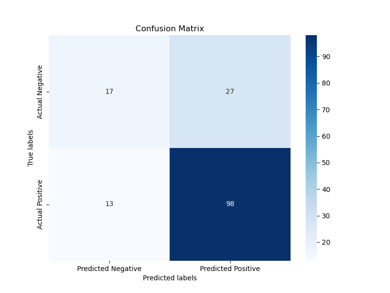

# 🚀 Predicting Startup Success

## 📌 Overview
This project uses **data analytics** and **machine learning** to develop a predictive model for **startup success**. By analyzing historical startup data, we identify key success factors such as **funding, team composition, market trends, and product-market fit**. 

🔹 **Objective**: Assist investors, entrepreneurs, and accelerators in making **data-driven decisions**  
🔹 **Techniques**: Machine learning models (Logistic Regression, Random Forest, XGBoost)  
🔹 **Dataset**: Kaggle-based startup success data  

## 👥 Authors
- **Chris Crown**
- **Amith Joseph**
- **Ian Macharia**
- **Philip Okoma**

---

## 📊 Dataset
We use a **comprehensive startup dataset** from **Kaggle**, containing:
- **Funding History**: First funding, last funding, total funding
- **Company Data**: Industry focus, market trends, growth trajectory
- **Investor Information**: Number of investors, funding rounds
- **Founder Profiles**: Education, experience, past employment
- **Geographical Factors**: Startup ecosystem, regional funding patterns

📌 **Dataset Link**: [Kaggle - Startup Success Prediction](https://www.kaggle.com/datasets/manishkc06/startup-success-prediction)

---

## ⚙️ Methodology
### **1️⃣ Data Preprocessing**
- Cleaned and formatted data
- Handled missing values (**16.47%** of data removed)
- Applied **one-hot encoding** for categorical variables
- Transformed the **"status"** column into a **binary classification** problem (Success = 1, Failure = 0)

### **2️⃣ Feature Selection**
- Used **Lasso Regression (L1 Regularization)** to select key predictors
- Reduced dataset from **635 features → 35 features** (improved efficiency)

### **3️⃣ Model Training & Evaluation**
✅ **Models Tested**:
- **Logistic Regression**
- **Decision Tree (CART)**
- **Random Forest**
- **XGBoost** (Best Model)

✅ **Performance Metrics**:
- **AUC Score**
- **Precision & Recall**
- **Cross-validation accuracy**

### **4️⃣ Business Strategy**
- **High-Risk Investors**: Use **Random Forest** to minimize **false negatives** (avoid missing successful startups)
- **Low-Risk Investors**: Use **CART** to minimize **false positives** (avoid investing in failing startups)
- **XGBoost** achieved the highest **AUC of 0.817**, making it the **best model**.

---

## 📈 Results & Model Performance
| Model | Variables | AUC | CV AUC | Precision (1) | Precision (0) |
|--------|------------|------|--------|---------------|---------------|
| CART | All | 0.572 | 0.670 | 0.81 | 0.56 |
| Random Forest | All | 0.697 | 0.749 | 0.78 | 0.77 |
| **XGBoost** | **All** | **0.655** | **0.843** | **0.78** | **0.74** |
| CART | Lasso Selected | 0.654 | 0.702 | 0.82 | 0.63 |
| Random Forest | Lasso Selected | 0.691 | 0.766 | 0.74 | 0.95 |
| **XGBoost** | **Lasso Selected** | **0.658** | **0.817** | **0.76** | **0.78** |

---

## 📌 Key Insights from the Model
✔ **Top Features Influencing Startup Success**:
1. **Average Number of Participants in Funding Rounds** → More investors = higher engagement & support  
2. **Total Funding in USD** → Higher financial backing = better success probability  
3. **Time Since Last Milestone** → More recent achievements = stronger growth momentum  
4. **Top 500 Ranking** → Startups in top industry rankings tend to succeed more  

✔ **Confusion Matrix & ROC Curve Analysis**:
- **ROC Curve**:  
  
- **Confusion Matrix**:  
  

---

## 🛠️ How to Use This Project?
### **1️⃣ Clone the Repository**
```bash
git clone https://github.com/amithjoseph777/Predicting-Startup-Success.git
cd Predicting-Startup-Success
